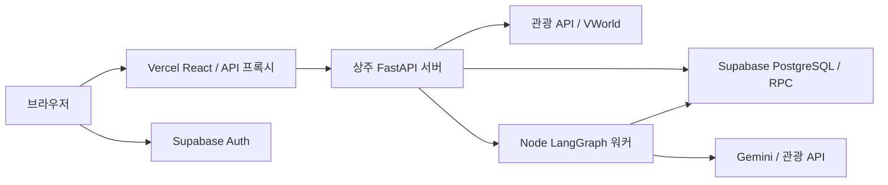

# 최신 코드 통합 후 FastAPI 구현 방향

2026-09-20. 이번 작업은 최신 GitHub 코드의 로컬 통합과 구현 방향 정리다. 신규 검토 API 개발, 원격 push, Vercel/FastAPI 배포, Supabase 데이터 변경은 하지 않았다.

## 1. 로컬에 반영한 코드

- GitHub 기본 master `29fb379`: 전국 대시보드·지도, 월간 브리핑 DB 저장, 설정·테마.
- 사용자가 추가로 선택한 SJbranch `f25dc86`: 고정 시뮬레이션 값 제거, 축제 사례 분석 스크립트와 JSON, 정책 근거 표시, 불필요한 UI 제거, 집중도 결측 처리.
- 기존 로컬 작업: Supabase Auth 로그인, 기관별 입력 조건 저장·조회, DB 재설계 및 검증 테스트.
- 브랜치: `codex/sync-master-20260920`. 원래 JSBbranch의 미커밋 변경은 `60ec88c` 체크포인트로 보존했고, master 병합은 `c6d1624`에 기록했다. 원격 브랜치는 변경하지 않았다.

충돌 해결 시 최신 master의 LangGraph와 월간 브리핑 테스트를 그대로 유지했다. 작동하는 테마 설정 버튼은 유지하고 SJbranch의 미동작 검색·알림·도움말 제거를 반영했다. 시나리오 타입은 전국 지역 ID를 받도록 합쳤고, 기관 저장 기능도 유지했다.

축제 통계는 원래 광주 자치구 대상 화면에서 사용했다. 전국 화면으로 합치면서 자치구 범위에 맞는 지역에만 문화축제 자료를 연결했다. 군/도 소속 시군구에는 자치구 통계를 적용하지 않는다. 검토 중 발견한 서울 송파구(11710)·강동구(11740)의 분류 오류는 화면·분석 코드·SQL에서 `festival-reference-v2`로 수정했다. 과거 통계를 예산·정책 기간에 비례해 확대하지 않는다.

현재 체크인된 분석 JSON은 원본 그대로다. 원시 분석 자료 디렉터리가 없어 이번 작업에서 통계를 재생성하지 않았으며, 기존 metroGu 표본에서 두 자치구 사례가 빠졌을 가능성은 새 분석 버전 생성 시 재확인해야 한다. 기존 DB에 v1 SQL을 적용했다면, 새 검토 API 연결 전에 [검토 범위 보정 SQL](supabase-review-scope-fix.proposed.sql)을 후속 변경으로 검토·적용한다. 이 SQL은 데이터·테이블을 지우지 않고 해당 함수와 권한만 갱신하며, 이번 작업에서는 원격 실행하지 않았다.

## 2. 이미 구현된 FastAPI

새 서버를 처음부터 만들 필요는 없다. 현재 `backend/app.py`와 `backend/scenarios.py`를 확장한다.

| 기능 | 현재 경로 | 상태 |
|---|---|---|
| 서버 상태 | GET /api/health | 구현. 프로세스 응답·관광 API 설정 여부 확인 |
| 전국 지역 목록 | GET /api/regions | 구현 |
| 관광 지표·진단 | GET /api/district/{resource} | summary, visitors, indices, contents, festivals, related, rank, diagnosis 구현 |
| 관광 콘텐츠·지도 | GET /api/tourism, GET /api/vworld | 구현 |
| 월간 브리핑 | GET/POST /api/monthly-briefing | 조회/최초 생성 및 Supabase 저장 구현 |
| 공개 로그인 설정 | GET /api/account/config | 구현. URL·publishable 키만 반환 |
| 소속 기관 | GET /api/account/organizations | 구현. JWT 검증 후 소속 조회 |
| 시나리오 입력 | POST/GET /api/scenarios, GET /api/scenarios/{id} | 구현. 기관 권한·멱등 저장·페이지 조회 |
| 분석 근거 import/조회 | 아래 3절 | 미구현. 현재 UI는 번들 JSON 사용 |
| 검토 스냅샷 저장/조회 | 아래 3절 | 미구현. DB 테이블/RPC 설계는 준비됨 |

사용자는 Supabase 테이블 8개와 RLS 활성화 결과를 확인했다. 이는 원격 RPC 권한·실제 로그인·저장이 검증됐다는 의미는 아니다. 현재 Codex Supabase 커넥터는 해당 프로젝트의 조회 권한이 없다.

## 3. 다음에 구현할 것: 두 단계

### 단계 A — 공통 분석 근거 등록·조회

새 파일 제안: `backend/evidence.py`, `backend/import_evidence.py`.

1. 운영자용 CLI가 `src/assets/data/festival-effect.json`을 읽는다. 공개 웹 요청으로 임의 분석 파일을 받지 않는다.
2. 파일 바이트 SHA-256, schema version, 12개 통계, 숫자 유한성/구간/표본, 커밋과 provenance_revision을 검증한다.
3. `import_policy_evidence` RPC로 원본과 12개 통계를 원자적으로 저장한다. 현재 자료는 원본 실행 manifest가 없으므로 `partial` provenance다. 단순 SQL 적용만으로 분석 데이터가 채워지지는 않는다.
4. 같은 SHA·출처 리비전 재시도는 같은 release_id. 출처 증명을 보완하면 새 리비전으로 등록한다. complete는 원본 보관 파일의 존재·실제 바이트 체크섬까지 import 도구가 검증한 뒤 사용한다.
5. `GET /api/policy-evidence?policy=festival&district=12210`을 추가한다. 서버가 정규 지역·분석군을 고르고 `releaseId`, `statisticId`, `status`, `basis`, `outcome`, `sampleCount`, `meanPct`, `ci95Pct`, 자료 기간과 선택 규칙 버전을 반환한다.
6. `src/data/festivalEffect.ts`의 번들 JSON 직접 조회를 서버 응답으로 교체한다. DB 미연결 시 저장된 근거인 것처럼 번들 값으로 조용히 대체하지 않는다.

근거 JSON의 version=1은 파일 구조 버전이다. 서로 다른 분석 산출물의 고유 버전은 release_id/SHA-256/출처 리비전으로 구분한다. 등록 도구는 새로 만든 난수나 가정값을 통계로 seed하지 않는다.

### 단계 B — 기관별 검토 결과 저장·조회

새 파일 제안: `backend/reviews.py`, `backend/tests/test_reviews.py`.

| 신규 API | 책임 |
|---|---|
| POST /api/scenarios/{id}/reviews | 검증한 입력 조건에 대해 당시 기준선과 참조 통계를 고정해 저장 |
| GET /api/scenarios/{id}/reviews | 같은 기관의 시나리오 검토 이력, 커서 페이지 |
| GET /api/scenario-reviews/{id} | 저장한 baseline과 정확한 evidence release를 반환 |

POST 처리 순서:

1. Authorization의 사용자 JWT를 Supabase Auth로 검증하고 현재 기관 소속·editor/admin 권한 확인.
2. 시나리오를 기관 범위로 읽고, 서버가 요청자·기관·시나리오·요청한 릴리스 선택을 기준으로 요청 해시 계산. 클라이언트의 사용자 ID/결과값/해시를 신뢰하지 않음.
3. 같은 Idempotency-Key로 이미 저장된 검토가 있으면 해시를 대조한 뒤 그대로 반환. 재전송마다 자료를 새로 수집하지 않음.
4. 서버가 기존 `DistrictService`로 summary/diagnosis를 조회. 정규 지역 코드, 출처별 기준월·단위·fetchedAt·규칙 버전을 검증하고 capturedAt을 기록.
5. summary/diagnosis를 확보한 상태에 따라 complete/partial/unavailable 구분. 확보하지 못한 값은 NULL로 보존.
6. 정확한 분석 릴리스를 선택하고 `save_scenario_review` RPC 호출. RPC가 기관 소속과 시나리오 일치, 선택 범위, 기준선 지역·시각, 멱등성을 다시 검사하여 한 번에 저장.
7. review_id를 반환. 화면·전략 비교·보고서는 이 ID로 당시 스냅샷과 원래 분석 버전을 다시 조회.

입력 조건은 `simulation_scenarios`, 당시 검토 결과는 `scenario_reviews`, 공통 통계는 `policy_evidence_*`다. 같은 내용을 테이블마다 별도 계산하거나 LLM으로 수치 재작성하지 않는다.

## 4. 공통 모듈과 검증 경계

현재 `backend/scenarios.py`의 `ScenarioDatabase`는 Auth 확인과 Supabase HTTP 호출을 함께 담당한다. 새 모듈을 추가할 때 이 연결 부분을 `backend/supabase.py` 같은 공통 모듈로 옮겨 재사용하고, scenarios/evidence/reviews에는 도메인 검증만 남긴다. 새 로그인 체계나 별도 DB 연결 설정을 추가하지 않는다.

- 읽기는 사용자 JWT + RLS + organization_id 필터. 신뢰된 서버의 근거 조회/import와 쓰기 RPC에만 secret 권한 사용.
- 외부 Supabase 오류 본문·서버 키·토큰은 로그/응답에 노출하지 않음.
- schema validation은 FastAPI/Pydantic이 하고, 원자성·소속/참조·고유 키·숫자 제약은 PostgreSQL RPC가 확인.
- 분석 결과를 등록하는 작업은 별도 운영 명령. 오래 걸리는 원본 수집/재분석을 사용자 HTTP 요청 안에서 매번 실행하지 않음.
- 향후 계수 모델·예산 반응 모델이 실제 생기기 전에는 simulation_runs/영속 예측 워커를 추가하지 않음.

필수 회귀 검사: 타 기관 ID/뷰어 쓰기 차단, 탈퇴 후 접근 차단, 같은 키 재전송/다른 본문 충돌, 자료 일부 실패, 지역·기준월 혼입 차단, 새 릴리스 등록 후에도 옛 검토 불변, 숫자 없는 정책에 임의 효과가 생기지 않음.

## 5. 배포 구조



현재 Vercel 설정은 React 정적 배포와 API 전달 어댑터다. Python FastAPI를 자동 배포하지 않는다. **기존 코드 그대로라면 Python과 Node를 함께 설치한 상주 서버/컨테이너 한 개**에 FastAPI를 두고 Vercel이 HTTPS로 연결하는 구성이 맞다.

FastAPI는 Node 워커를 자식 프로세스로 실행한다. 따라서 서버 배포물에 `backend/`, `server/briefing/`, TS가 참조하는 `src/data/`, `src/types/`, package lock과 운영 Node 의존성이 포함돼야 한다. Python 파일만 복사하거나 LangGraph를 독자적으로 Python으로 재작성하지 않는다.

| 위치 | 환경변수 |
|---|---|
| FastAPI 서버 | SUPABASE_URL, SUPABASE_PUBLISHABLE_KEY, SUPABASE_SECRET_KEY 또는 SUPABASE_SERVICE_ROLE_KEY |
| FastAPI 서버 | TOUR_API_SERVICE_KEY, GEMINI_API_KEY, GEMINI_MODEL; 선택적으로 VWORLD 설정 |
| Vercel | FASTAPI_BASE_URL=https://실제-백엔드-주소 |
| 양쪽 | 동일한 FASTAPI_PROXY_TOKEN |

로컬 실행은 루트 `.env.local`/`.env`를 읽는 `backend.run`을 사용한다. 운영에서는 호스트의 환경변수/비밀값 관리 기능을 사용한다. 프로젝트 폴더의 비밀 파일은 Git 대상이 아니지만 이 경로는 Syncthing 공유 폴더라는 점을 고려한다.

현재 구현으로 실행 가능한 명령:

```powershell
# Python/Node 의존성 설치 후 로컬 React + FastAPI 실행
npm run dev

# FastAPI 단독 실행(운영 환경변수는 사전에 설정)
& .venv/Scripts/python.exe -m backend.run --host 0.0.0.0 --port 8000
```

운영에서는 HTTPS ingress, 장애 시 프로세스 재시작, secret 없는 로그를 갖춘 단일 인스턴스로 시작한다. `--reload`는 사용하지 않는다. 현재 캐시와 관광 API 호출 예산은 프로세스 메모리에 있으므로 여러 인스턴스로 늘리기 전에 공유 예산/캐시가 필요하다. 현재 월간 생성 상태·동시 생성 제한은 DB가 맡지만 일반 관광 API의 전체 할당량까지 통합 관리하지는 않는다.

월간 브리핑 시간 제한은 Node 분석 240초, DB 임대 280초, Python 285초, Vercel 전달 290초, 함수 설정 300초다. 실제 호스팅의 허용 시간과 ingress 제한을 확인해야 한다. 현재 구조가 먼저 정상 동작한 후 필요하면 장기 실행을 별도 작업 처리 방식으로 바꾼다.

추가 운영 구현: 기존 `/api/health`는 생존 확인으로 유지하고, Supabase 읽기/RPC 접근 및 Node 실행 준비 상태를 확인하는 내부 readiness 경로를 별도로 만든다. readiness 확인 때문에 실제 브리핑 생성이나 유료 AI 호출을 실행하지 않는다.

## 6. 이번 통합 검증

- Node 테스트 87건, LangGraph 테스트 17건, Python/API/축제 분석 테스트 51건 통과: 총 155건.
- 앱 타입 검사와 프로덕션 빌드 통과. 기존 번들 크기·의존성 주석 경고는 남아 있다.
- 격리된 브라우저에서 로그인·기관 저장·재조회·기관 전환, 전국 라우트, 서울 자치구/군의 근거 범위, 테마·페이지 이동을 확인했다. 브라우저 외부 API는 테스트 응답을 사용했으며 운영 계정 검증은 아니다.
- 과거 분석 JSON을 다시 계산하지 않았고 외부 관광 API/Gemini/Supabase 운영 호출도 하지 않았다.
- 신규 검토 API와 import 도구는 위 설계에 따라 다음 작업에서 구현한다. 현재 화면의 저장 버튼은 입력 조건 저장이다.
