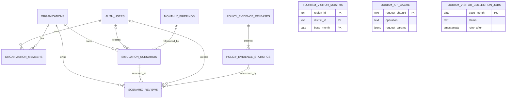

# Travel-project 데이터베이스 재설계

기준일: 2026-09-20 KST. **현재 권고 설계의 진입 문서다.** GitHub 최신 브랜치를 fetch하여 확인했고, 기존 로컬 구현은 보존했다. 이 작업은 설계·SQL의 로컬 검증이며 앱 통합, 원격 테이블 삭제·생성, GitHub 병합·배포는 수행하지 않았다.

후속 현황(같은 날): master와 SJbranch 및 기존 로컬 저장 구현을 `codex/sync-master-20260920`에서 통합했다. 사용자는 원격 8테이블·RLS 적용 결과를 확인했다. 분석 근거 import/API와 기관 검토 저장·조회·화면 연동까지 로컬 구현했다. 실제 서버 설정과 검증 현황은 [FastAPI 구현 방향](fastapi-implementation-plan.md)을 우선 참조한다. 아래 1절은 재설계 당시의 브랜치 현황 기록이다.

## 1. 최신 작업 현황과 설계 근거

| 구분 | 확인한 상태 | DB 설계에 주는 영향 |
|---|---|---|
| 기본 브랜치 master | `29fb379d4d85a8b5445d5a107acf3ecc877f643a`. main `a3be986`과 내용 트리가 같음. PR #11/#12 병합 완료 | 월간 브리핑 SQL 001/002와 기존 RPC 계약을 유지 |
| 최신 병합 기능 | 전국 지도·대시보드, 월간 브리핑 영속 저장, 설정 모달·테마 | 지역 ID는 전국 카탈로그 사용. 테마는 현재 localStorage로 충분 |
| master 시뮬레이션 | store의 완료 결과가 아직 +15/+18/+11/-8 고정값 | 이 값을 DB 분석 결과로 이관하지 않음 |
| SJbranch | `f25dc8673420c451d3fdb4482fce5feb00a485f1`. 고정값 제거, 축제 분석 스크립트와 JSON, 문화축제·야간 정책에 과거 통계 참조 추가 | 입력 조건과 과거 분석 근거 버전을 별도 저장. 아직 master에 병합되지 않음 |
| 로컬 JSBbranch | HEAD `36f7628`. 이전 작업의 기관 로그인·시나리오 저장 API/UI/SQL이 미커밋 상태 | GitHub에 이미 구현된 기능으로 보고하지 않음. 재설계는 이 저장 계약을 이어받음 |
| 실제 Supabase | `uyrnqwilluirwehiggtk`. 사용자가 제공한 조회 결과: 구형 시뮬레이션 8테이블, 모두 0행 | 현재 계정으로 원격 조회 불가. 삭제·초기화가 완료됐다고 간주하지 않음 |

주요 근거:

- [PR #11](https://github.com/tnwjd508/Travel-project/pull/11), [PR #12](https://github.com/tnwjd508/Travel-project/pull/12).
- [master 브리핑 저장 계약](https://github.com/tnwjd508/Travel-project/blob/29fb379d4d85a8b5445d5a107acf3ecc877f643a/server/briefing/repository.ts).
- [master의 고정 시뮬레이션 값](https://github.com/tnwjd508/Travel-project/blob/29fb379d4d85a8b5445d5a107acf3ecc877f643a/src/stores/useTourismStrategyStore.ts).
- [SJbranch 정책 근거 선택](https://github.com/tnwjd508/Travel-project/blob/f25dc8673420c451d3fdb4482fce5feb00a485f1/src/data/festivalEffect.ts), [분석 코드](https://github.com/tnwjd508/Travel-project/blob/f25dc8673420c451d3fdb4482fce5feb00a485f1/scripts/festival-effect/analyze.py), [결과 JSON](https://github.com/tnwjd508/Travel-project/blob/f25dc8673420c451d3fdb4482fce5feb00a485f1/src/assets/data/festival-effect.json).

## 2. 핵심 결정

**하나의 Supabase 프로젝트에 11개 서비스 테이블을 사용한다.** 기존 10개 테이블에 전국 방문자 월 수집의 선점·재시도를 관리하는 작업 테이블 1개를 추가한다. 별도 users/passwords 테이블은 만들지 않는다.

이전의 `simulation_model_versions / simulation_runs / simulation_run_attempts / simulation_input_snapshots / simulation_results / simulation_result_metrics` 6개는 미래 예측 엔진과 영속 워커를 전제로 한다. 현재 SJbranch는 미리 계산한 JSON 통계를 조회하므로 이 구조를 지금 요구하지 않는다. 향후 예산·기간·지역에 따라 새 예측을 실제 계산하는 엔진이 생기면 별도 확장한다.

현재 저장해야 하는 세 가지를 분리한다.

1. **기관 시나리오:** 사용자가 선택한 지역·정책·예산·시작월·기간.
2. **공통 분석 근거:** 특정 버전의 축제 분석 자료와 통계. 기관마다 복제하지 않음.
3. **기관 검토 기록:** 당시 조회한 실제 지역 진단·지표 응답과 선택된 분석 근거. 최신 자료로 재조회해도 과거 기록을 바꾸지 않음.

## 3. ERD와 테이블



`monthly_briefing_jobs`는 브리핑 생성 잠금·실패 이력이다. 완료 결과와 동일한 지역·월 키를 쓰지만, 실패한 작업에는 브리핑 행이 없으므로 결과 존재를 강제하는 FK를 두지 않는다.

| 테이블 | 저장 단위·주요 필드 | 접근 |
|---|---|---|
| monthly_briefings | 지역·월당 확정 결과 한 건. region_id, district_id, analysis_month, payload, ai_status, generated_at, saved_at, model_name | 서버 RPC |
| monthly_briefing_jobs | 지역·월당 생성 상태 한 건. status, owner_token, deadline_at, error_code, source_snapshot | 서버 RPC |
| organizations | 업무 기관. id, name | 소속 회원 조회, 운영자 관리 |
| organization_members | 기관·사용자 소속. organization_id/user_id PK, role | 본인 소속 조회, 운영자 관리 |
| simulation_scenarios | 저장 조건 한 건. organization_id, created_by, title, region/district, policy, budget_krw, start_month, duration_months, briefing_month, idempotency_key | 기관 공동 조회, editor/admin 저장 |
| policy_evidence_releases **신규** | 분석 결과 파일 한 버전. id, artifact_schema_version, artifact_sha256, repository_commit, generated_at, artifact_payload, provenance_status, provenance | 서버/운영자 |
| policy_evidence_statistics **신규** | 한 버전·대상 집단·분석군의 통계. release_id, outcome, segment, sample_count, mean_pct, median_pct, CI, share_positive | 서버 조회 |
| scenario_reviews **신규** | 한 시나리오를 한 번 검토한 고정 기록. organization_id, scenario_id, evidence_statistic_id, reference_status, baseline_snapshot, selection_rule_version, idempotency_key | 기관 공동 조회, editor/admin 저장 |
| tourism_visitor_months **신규** | 지역·월별 일별 추정 방문자 합계와 완전성. region_id, district_id, base_month, local/outside/foreign/total, observed_days, expected_days, complete | 서버 RPC 전용 |
| tourism_api_cache **신규** | 모든 한국관광공사 API 페이지. 비밀키를 제외한 operation+params 해시, 검증된 공개 응답, 원천 수집 시각 | 서버 RPC 전용 |
| tourism_visitor_collection_jobs **신규** | 전국 방문자 월별 수집 선점·완료·실패·재시도 시각. base_month, status, owner_token, deadline_at, retry_after | 서버 RPC 전용 |

### 공통 지역·단위

- 지역 카탈로그는 TypeScript 원본과 생성된 Python JSON을 유지한다. DB에서 독립적으로 편집하는 지역 마스터를 새로 만들지 않는다.
- 저장 식별자는 `region_id + district_id`다. 광주 동구는 `jeonnam-gwangju / 12210`, URL 별칭 `gwangju/donggu`는 경계에서 정규화한다.
- 예산은 정수 원: 15억 → 1,500,000,000. 기간은 개월: 1년 → 12. 시행 시작월은 해당 월 1일 DATE.
- 방문 지표는 외지인/전체 **일별 방문 추정치**를 구별한다. 소비·체류 지수는 금액·시간으로 바꾸지 않는다.
- 시나리오 시행 시작월, 월간 브리핑 진단 월, 지표 기준월, 축제 분석 자료의 관측 기간은 서로 다른 필드다.

## 4. SJbranch 분석 결과의 정확한 저장 계약

### 현재 있는 것

`analyze.py`는 같은 지역의 축제 기간 방문과 2~4주 전 같은 요일 평균을 비교하고, 같은 시도 비축제 지역의 로그 비율 변화를 차감한다. 비교 지역이 3개 이상이어야 하며 1~7일 축제를 사용한다. bootstrap 2,000회와 위약 날짜 선택에 RNG seed 42를 사용한다.

출력의 `meanPct`는 **개별 사건 퍼센트의 산술평균이 아니라 `(exp(mean(log_effect))-1)*100`**이다. 95% 구간은 집계 평균 추정의 bootstrap 구간이다. 특정 새 축제나 미래 정책의 효과가 이 구간 안에 들어간다는 뜻은 아니다. 방법명에 이중차분이 있다고 해서 식별 가정·평행추세·적용 가능성 검증까지 완료됐다고 표시하지 않는다.

관측 문서에는 visits 기간 `2018-01-01~2026-08-20`, usable festivals 936, outside 유효 사례 892가 들어 있다. **936을 모든 통계의 표본 수로 사용하면 안 된다.** 분석군마다 각 `n`을 보존한다. 집단은 서로 겹치므로 합산하지 않는다.

| SJbranch UI 선택 | 보존할 통계 | 원문 값 | 해석 |
|---|---|---|---|
| 문화축제 | outside / metroGu | n=271, meanPct=1.7, CI 0.7~2.6 | 전국 특별·광역시 자치구 축제의 과거 참조 통계 |
| 야간관광 | outside / night | n=41, meanPct=1.7, CI -0.8~4.3 | 제목에 야간 키워드가 있는 축제 통계. 현재 UI 규칙상 근거 부족 |
| 셔틀·마켓·예술 | 없음 | NULL | 해당 정책의 근거 자료 미연결 |

앞의 숫자는 체크인된 분석 결과를 보존하기 위한 매핑 검증값이다. 이번 작업에서 원본 방문자·축제 데이터를 다시 수집하거나 통계 분석을 독립 재현하지 않았다. 예산 15억/50억, 기간 3/12개월을 선택해도 같은 과거 참조 통계이며 계수로 곱하지 않는다.

### 분석 버전과 중복 저장

JSON의 `version: 1`은 파일 구조 버전이다. 다음 분석도 version=1일 수 있으므로 결과 버전의 고유키로 쓰지 않는다. `id UUID`와 **원본 파일 바이트의 SHA-256 + provenance_revision**을 사용한다. 같은 파일·출처 리비전·등록 메타데이터로 재시도하면 동일 release_id를 반환한다. 같은 키에 다른 출처를 보내면 충돌로 거절한다. 같은 파일의 출처 증명이 보완되면 새 provenance_revision과 새 release_id로 보존하며 이전 검토의 참조는 유지한다.

`artifact_payload`가 분석 결과의 원본이다. 12개 통계 행은 `(outside,total) × (all,short,long,night,metroGu,placebo)`의 **검색용 파생 데이터**다. import RPC 하나가 원본과 통계 12행을 같은 트랜잭션에서 만들고, 별도 수동 입력·수정을 허용하지 않는다. 한 통계라도 잘못되면 전체 등록이 롤백된다. 이 제한된 중복은 타입·제약·FK를 얻기 위한 것이며 서로 다른 진실의 원본을 만들지 않는다.

현재 JSON의 광주 개별 사례 15건은 artifact_payload.gwangju에 그대로 보존한다. 화면에 없는 전체 개별 결과나 원시 방문자 테이블을 임의로 만들어 채우지 않는다. 규모가 커지면 원문은 private Storage의 불변 경로로 분리하되 먼저 보존 정책·가용성 확인을 설계한다. 서명 URL이나 API 키는 provenance에 저장하지 않는다.

### 재현성 한계의 명시

현재 원본 일별 방문자 CSV, 축제 원문·병합 데이터, 전체 개별 분석 결과는 Git 제외 디렉터리에 있으며 코드 저장소만으로 확인되지 않는다. JSON에는 원본 파일 해시·수집 시각·실행 manifest도 없다.

따라서 기존 JSON을 가져올 때 `provenance_status='partial'`로 기록한다. `repository_commit`은 파일을 확인한 커밋이지 실행 당시 코드 버전의 증명은 아니다. `complete`로 올리려면 실제 raw artifact 목록의 불변 위치·해시, 수집 시각, 생산 코드 커밋, 파라미터/RNG/실행 순서·런타임을 검증해 **새 출처 리비전의 릴리스**로 등록해야 한다. import RPC는 구조·해시 형식·수집 시각·필수 메타데이터를 검사하며, 실제 Storage 객체의 존재와 체크섬 대조는 운영자 import 도구가 담당한다. complete는 출처 자료의 완비를 뜻하며 통계의 인과성 검증을 뜻하지 않는다.

검증에 사용한 원본 파일 SHA-256: `b1d4fc0fbe702c517d791e6c9724ae5be1a8a8d709c5ad789a96864a28736c9d`.

## 5. 검토 기록의 불변성과 상태

`simulation_scenarios`는 입력 조건이다. `scenario_reviews`는 **그 조건을 검토한 당시의 결과**다. 시나리오 하나에 여러 시점의 검토를 남길 수 있다. 최신 분석 파일로 교체되더라도 예전 검토는 원래 통계 행을 계속 참조한다.

baseline_snapshot v1의 계약:

```json
{
  "request": { "regionId": "jeonnam-gwangju", "districtId": "12210", "indexMonth": "202608", "visitorMonth": "202607" },
  "capturedAt": "2026-09-20T00:00:00Z",
  "summary": null,
  "diagnosis": null
}
```

summary/diagnosis가 있으면 실제 API 응답 전체를 저장한다. 각 응답의 기준월·단위·fetchedAt·규칙 버전을 유지한다. 위 예는 수집 불가 상태의 형식 예시이며 실제 수집 결과로 seed하지 않는다. 서버가 직접 수집·검증하며, 사용자 POST가 보낸 결과를 그대로 저장하지 않는다. SQL도 complete/partial/unavailable별 응답 조합, 시나리오와 정규 지역 ID 일치, 기준월 및 capturedAt/fetchedAt 형식을 확인한다. 상세 지표의 의미·단위·출처·모델 구조는 API 계약 검증이 담당한다.

| reference_status | 의미 |
|---|---|
| available | 선택된 과거 통계가 있고 UI 선택 규칙에서 CI 하한 > 0 |
| insufficient_evidence | 통계의 CI 하한 ≤ 0이거나 원본 분석군이 null. 음수 하한도 그대로 보존 |
| unsupported_policy | 해당 정책의 자료 없음 |
| out_of_scope | 문화축제 metroGu 자료를 적용할 대상 자치구 범위 밖 |
| not_imported | 연결할 분석 릴리스가 아직 등록되지 않음 |

원래 SJbranch의 `policyEvidence(policy)`는 지역을 받지 않았다. 로컬 전국 통합에서는 지역 인수를 추가하고 군/범위 밖을 구분한다. 서울 송파구·강동구를 잘못 제외하던 코드 분류도 보정하여 화면·분석 코드·제안 SQL을 `festival-reference-v2` 규칙으로 맞췄다. 이미 v1을 설치했다면 `supabase-review-scope-fix.proposed.sql`로 함수만 후속 갱신하며 과거 검토의 v1 표시는 유지한다. 원본 통계 JSON 재분석은 별도 작업이다. 향후 행정구역 개편·범위 변경도 새 선택 규칙 버전으로 처리한다.

## 6. 권한·무결성·인덱스

- 같은 기관의 admin/editor/viewer는 저장 조건과 검토를 공동 조회한다. 작성자는 기록 소유자와 다르며 탈퇴 시 created_by만 NULL이 된다.
- 조회는 사용자 JWT와 RLS, 저장은 검증한 사용자 ID를 전달하는 서버 전용 RPC다. RPC가 membership을 다시 검사하고 커밋까지 잠근다. viewer·다른 기관 사용자는 저장 불가.
- `(organization_id, scenario_id)` 복합 FK로 다른 기관 시나리오 연결을 막는다. 통계 FK로 실제 등록된 릴리스만 참조한다.
- 브라우저에 분석 원문·등록 RPC·결과 쓰기 권한을 주지 않는다. 서비스 역할도 직접 UPDATE/DELETE 권한을 갖지 않는다. 함수는 search_path=''와 명시적 EXECUTE 권한을 사용한다.
- 분석 원문·통계·검토는 불변 trigger로 보호한다. Auth 계정 삭제에 따른 작성자 FK NULL 처리만 예외다.
- `(organization_id,idempotency_key)`로 네트워크 재전송 중복을 막는다. 같은 키에 다른 요청 해시는 409. 새로 검토하기는 새 키·새 행이다.
- 통계는 숫자 유한성, CI 순서, share_positive 0~1, 표본 0의 NULL 조합을 검사한다. 빈 값을 0%로 채우지 않는다.
- 조회 인덱스: 기관별 최신 검토, 기관·시나리오별 이력, release/outcome/segment UNIQUE, 분석 생성일, 작성자·통계 FK. 초기에는 파티션·JSON 전체 GIN·별도 웨어하우스를 추가하지 않는다.

## 7. 구현된 연결 계약 (2026-09-20 후속)

`/api/scenarios`는 입력 조건을 다루며, 별도 `/reviews` API가 검토 결과를 다룬다. FastAPI와 화면 연결은 구현했고 실제 Supabase 등록·배포는 남아 있다.

1. 운영자 import 명령: 원본 파일을 읽고 바이트 SHA-256을 계산 → 구조/출처 검증 → `import_policy_evidence` 호출. 사용자용 공개 import API는 만들지 않음.
2. `GET /api/policy-evidence`: 정책·정규 지역과 릴리스 버전으로 과거 통계·자료 범위 반환. 앱 번들 JSON 직접 참조를 서버 계약으로 교체.
3. `POST /api/scenarios/{id}/reviews`: 사용자 JWT·현재 기관·editor/admin 검증 → 같은 요청 키 존재 여부 우선 확인 → 서버가 기준선 응답 수집·지역/단위 검증 → 릴리스 선택 → `save_scenario_review` 호출.
4. `GET /api/scenarios/{id}/reviews` 및 `/api/scenario-reviews/{id}`: 기관 범위 조회, 고정 baseline + 참조한 정확한 릴리스의 통계 반환. 조회 중 최신 릴리스로 바꾸지 않음.
5. 보고서·전략 화면이 저장된 review_id를 선택하면 같은 스냅샷을 사용. 저장 검토 모드의 ReportPage는 DB 스냅샷을 읽어 인쇄하며, 검토 선택이 없을 때는 현재 조회값의 미리보기를 제공한다. 별도 PDF 파일·보고서 편집 이력은 현재 요청 범위 밖.

저장 POST 본문에는 숫자 효과나 baseline 응답을 받지 않는다. 기관 ID·scenario_id·선택한 release_id(또는 서버 기본 선택)·요청 키만 계약에 넣는다. 요청 해시는 인증한 사용자·기관·시나리오·요청된 릴리스 선택 기준으로 서버에서 계산한다. 재전송은 최초 저장된 스냅샷을 반환하고 관광 API/분석을 새로 실행하지 않는다.

## 8. SQL 파일과 실제 적용 상태

| 파일 | 역할·상태 |
|---|---|
| supabase/migrations/001_monthly_briefings.sql | master와 동일. 브리핑 2테이블 |
| supabase/migrations/002_monthly_briefing_jobs.sql | master와 동일. 기존 RPC |
| supabase/migrations/20260919115012_organization_scenarios.sql | 로컬 구현. 기관/회원/시나리오 3테이블와 저장 RPC |
| supabase/migrations/20260920104513_tourism_visitor_month_cache.sql | 관광객 월별 영속 캐시와 서버 전용 get/store RPC |
| supabase/migrations/20260920110556_tourism_api_response_cache.sql | 전체 관광 API 페이지 공유 캐시와 서버 전용 get/store RPC |
| supabase/migrations/20260920163732_tourism_visitor_collection_jobs.sql | 방문자 월별 수집 작업과 중복 방지·원자적 저장 RPC |
| docs/supabase-evidence-extension.proposed.sql | 이번 신규 설계. 근거 릴리스·통계·검토 3테이블와 import/save RPC. 로컬 API 연결 완료 |
| docs/supabase-current-design.proposed.sql | 위 여섯 파일을 하나의 트랜잭션으로 묶은 **빈 DB용 검증 설계안**. DELETE/DROP 없음 |
| docs/supabase-simulation-schema.proposed.sql | 미래 예측 실행용 이전 확장안. 이번 설치에 포함하지 않음 |
| docs/supabase-empty-legacy-reset.sql | 이전에 요청한 구형 8테이블 제거용 별도 파일. 이번 작업에서 실행하지 않음 |

빈 DB에서는 새 통합 설계안 한 파일의 구조를 검토할 수 있다. 이미 테이블이 있는 DB에서 이 CREATE 스크립트를 그대로 실행하면 중복 오류가 난다. 현재 8개 테이블이 적용된 DB에는 관광객 월별 캐시와 전체 관광 API 공유 캐시 후속 마이그레이션 두 개만 추가한다. 구형 8테이블이 있는 사용자 DB는 공유 기관 2개와 구형 예측 테이블 6개로, 현재 10테이블과 구성이 다르다. 삭제가 필요하면 당시 0행 조회 결과만 믿고 즉시 실행하지 않고 현재 상태·참조·적용 이력을 다시 확인한다.

최신 요청은 재설계이므로 중단됐던 전체 초기화 작업을 재개하지 않았다. 원격 프로젝트에 접속할 권한이 없어 실제 스키마·migration history를 직접 검증하지 못했다. 현재 SQL은 코드 기반 로컬 검증안이며 실제 적용 시 Supabase CLI로 정식 후속 마이그레이션을 생성하고 대상 DB와 이력을 대조한다. 기존 001/002를 덮어 수정하거나 auth/storage/internal 스키마를 초기화하지 않는다.

## 9. 검증과 남은 작업

2026-09-20 관광 API 캐시 확장에서는 후속 SQL을 PostgreSQL 엔진에 적용해 서버 전용 RPC, RLS, 요청 해시 충돌 차단, 잘못된 응답 거부와 완전 방문자 자료를 부분 자료로 덮어쓰지 않는 규칙을 검증한다. 원격 Supabase 적용과 운영 백필은 별도 단계다.

`tests/evidence-schema-design.test.mjs`는 SJbranch의 실제 결과 JSON을 테스트 fixture로 읽는다. 원격 DB나 실제 사용자 데이터는 사용하지 않는다. PGlite의 PostgreSQL 엔진에서 기본 5테이블 + 신규 3테이블, 실제 12개 통계 매핑, 멱등 import/save, 잘못된 통계의 전체 롤백, 기관 격리, viewer 차단, 불변성, 탈퇴 후 기록 보존을 검증한다.

후속 로컬 작업에서 브랜치 통합과 새 API/UI 연결을 완료했다. 남은 것은 GitHub 반영, 원본 분석 실행 자료 확보, 대상 Supabase의 후속 계약 SQL 적용·자료 등록, 서버 배포 및 실계정 검증이다. 이 설계 검증을 이미 운영 서비스가 연결됐거나 통계의 인과성이 입증됐다는 의미로 보고하지 않는다.

공식 확인: [RLS와 권한](https://supabase.com/docs/guides/database/postgres/row-level-security), [DB 함수](https://supabase.com/docs/guides/database/functions), [변경 이력](https://supabase.com/changelog). 확인일 2026-09-20. 이 설계는 Realtime 내부 스키마 변경, 만료 예정 관리 logs API, 확장 버전 고정에 의존하지 않는다.
