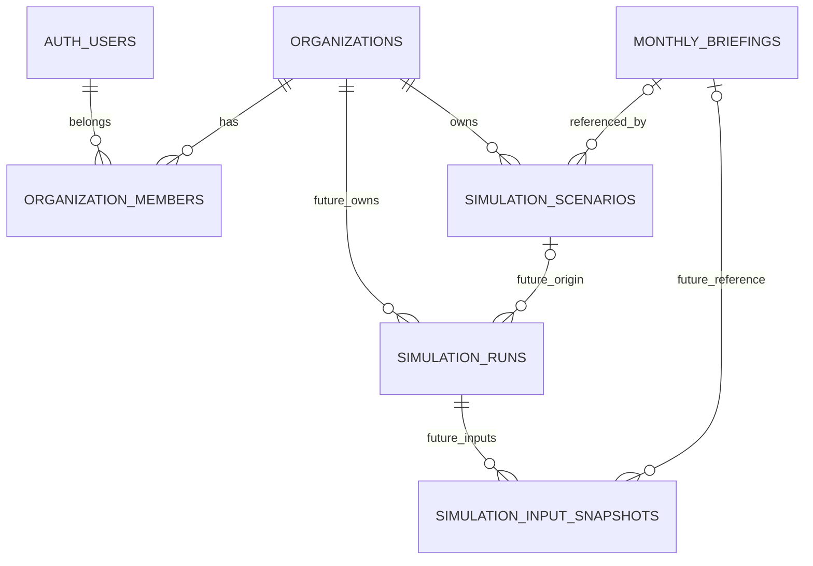

# Supabase 통합 설계·운영

> 2026-09-20 갱신: 이 문서는 9월 19일 로컬 구현 기록이다. 최신 GitHub 반영 DB 설계는 [데이터베이스 재설계](supabase-database-design.md)를 우선한다. SJbranch에 추가된 과거 축제 통계와 검토 결과 보존을 위한 3개 테이블은 새 설계에 있다. 아래의 “구현”은 로컬 변경이며 master 배포 완료를 뜻하지 않는다.

2026-09-19. 월간 브리핑과 기관 시나리오를 **하나의 Supabase 프로젝트**에 저장한다. React 로그인·FastAPI 저장/조회·SQL을 연결했다. 원격 프로젝트 생성, 운영 DB 마이그레이션 적용, 실제 계정으로 저장하는 배포 검증은 아직 수행하지 않았다.

## 무엇을 합쳤는가

| 항목 | 통합 방식 |
|---|---|
| 프로젝트·접속 설정 | 서버의 SUPABASE_URL 하나. 월간 브리핑과 시나리오가 같은 서버 키 사용 |
| 사용자·소속 | auth.users + organizations + organization_members 한 벌만 사용 |
| 지역 | 관광 카탈로그의 region_id/district_id. 광주 동구는 jeonnam-gwangju / 12210. URL 별칭 gwangju/donggu는 저장 전에 정규화 |
| 월간 브리핑 | 기존 monthly_briefings / monthly_briefing_jobs 및 briefing_* RPC 유지 |
| 현재 시나리오 | simulation_scenarios에 입력 조건을 실제 저장. 같은 기관 구성원이 공동 조회 |
| 브리핑 재사용 | 시나리오의 region_id/district_id/briefing_month 복합 FK로 이미 저장된 원본 참조. 전체 payload 중복 저장 없음 |
| 미래 모델 실행 | 기존 시뮬레이션 SQL을 공통 테이블에 의존하는 6개 테이블 확장으로 변경. 아직 마이그레이션에 넣지 않음 |

브리핑은 공개 관광 자료에 대한 **지역·월별 한 건**, 시나리오는 **기관별 여러 저장 기록**이다. 두 중복 방지 규칙을 합치면 사용자의 조건별 기록이 사라질 수 있으므로 별도로 유지한다. 브리핑 작업 잠금과 향후 모델 실행 워커도 처리 시간·재시도 규칙이 달라 공용 큐로 바꾸지 않았다. Gemini 문장 생성 모델은 정책 효과 추정 모델의 validated 버전으로 등록하지 않는다.



## 현재 동작 범위

- 월간 브리핑: 기존 PR #11 저장 서비스의 GET 조회, 최초 POST 생성, 생성 중 조회, 실패·중단 상태, 저장 후 재생성 금지 흐름을 가져왔다.
- 시나리오 화면: Supabase 이메일/비밀번호 로그인, 기관 선택, 조건 저장, 최신순 목록/추가 페이지, 상세 재조회, 저장 URL, 기존 조건 불러오기, 로그아웃.
- 저장 정보: 지역·정책·예산(원)·시행 시작월·기간(개월), 작성자·기관·저장 시각, 선택한 참고 브리핑 월. 제목과 정규 지역명은 서버에서 정한다.
- 브리핑 연결은 선택 사항이다. 지정한 지역·월의 저장 결과가 없으면 409이며 자동으로 AI를 실행하지 않는다.
- 응답 유실 후 같은 버튼으로 재시도하면 같은 Idempotency-Key를 사용한다. 저장 성공 후 다시 저장하면 새 기록이다. 새로고침은 저장 URL을 GET으로 재조회한다.
- 기존 고정 예상 효과는 이관하지 않는다. SJbranch의 시나리오 검토 수정분을 반영했다. 현재 진단은 실데이터 기준선이며, 저장된 시나리오의 과거 계산 결과라고 표시하지 않는다.

예산·기간별 미래 효과 추정 엔진은 아직 없다. SJbranch의 최신 추가 기능은 과거 축제 분석 통계를 참조하며, 그 저장 계약은 새 재설계 문서에 반영했다. 저장 성공을 미래 예측 완료로 표시하지 않는다. 미래 실행 생성·워커·결과 저장 API는 [모델 실행 확장 설계](supabase-simulation-design.md)의 별도 구현 과제다. 현재 보고서 화면의 인쇄/PDF 기능을 시뮬레이션 결과 DB 저장으로 간주하지 않는다.

## 권한 경계

1. 브라우저는 `/api/account/config`에서 URL과 `sb_publishable_` 공개 키만 받아 Supabase Auth에 로그인한다. 별도 VITE_ 키 설정은 필요 없다. 비밀번호는 FastAPI를 거치지 않는다. SDK가 세션 갱신을 담당한다.
2. FastAPI는 매 요청 Supabase `/auth/v1/user`로 사용자 JWT를 검증한다. origin 프록시 토큰으로 사용자 인증을 대체하지 않는다.
3. 조회에는 **공개 키 + 사용자 JWT**를 사용하고, 기관 필터와 RLS를 함께 적용한다. 다른 기관 ID나 기록 ID를 입력해도 조회할 수 없다.
4. 저장에는 검증한 사용자 ID를 서버 전용 `scenario_save` RPC로 보낸다. RPC도 현재 소속·editor/admin을 검사하고 membership 행을 트랜잭션 끝까지 잠근다. viewer나 탈퇴 사용자의 저장은 거절된다.
5. 브라우저의 직접 INSERT/UPDATE/DELETE 및 저장 RPC 실행 권한은 없다. 기관 등록·회원 관리는 초기에는 운영자가 수행한다. 기관 admin은 업무 역할이며 Supabase 프로젝트 관리자와 다르다.
6. 월간 브리핑 테이블은 기존처럼 서버 전용이다. 공통 설정을 합쳤다는 이유로 모든 테이블에 포괄 GRANT를 주지 않는다.
7. 작성자가 탈퇴해도 기관 기록은 남고 created_by만 NULL이 된다. 저장 조건을 수정하려면 새 기록을 만든다.

## API

| 경로 | 동작 |
|---|---|
| GET /api/account/config | 공개 Auth 설정. 서버 키 반환 금지 |
| GET /api/account/organizations | 현재 사용자의 기관과 역할 |
| POST /api/scenarios | 실제 조건 저장. Authorization, Idempotency-Key 필수 |
| GET /api/scenarios?organizationId=…&district=… | 같은 기관·지역 목록. 20건씩, nextCursor 지원 |
| GET /api/scenarios/{id}?organizationId=… | 저장 기록 상세 |
| GET /api/monthly-briefing?regionId=…&district=…&month=… | 기존 저장 브리핑 조회 |
| POST /api/monthly-briefing?… | 기존 규칙에 따른 최초 생성 |

Vercel 어댑터는 기관 경로에서만 사용자 Authorization, Idempotency-Key, JSON 본문을 전달한다. 기관 응답은 no-store이며 기존 관광 GET API의 POST 권한을 넓히지 않았다. Vite 프록시도 서버 origin 토큰을 전달한다.

## 설정과 적용 순서

같은 프로젝트에서 다음 값을 설정한다. `.env.example`을 참고하고 실제 비밀값은 커밋하지 않는다.

```dotenv
SUPABASE_URL=https://<project-ref>.supabase.co
SUPABASE_PUBLISHABLE_KEY=sb_publishable_...
SUPABASE_SECRET_KEY=sb_secret_...
```

기존 JWT 서버 키를 사용하면 SECRET_KEY 대신 SUPABASE_SERVICE_ROLE_KEY를 설정할 수 있다. 공개 인증에는 현대식 publishable 키를 사용한다. 월간 새 생성에는 기존 TOUR_API_SERVICE_KEY, GEMINI_API_KEY도 필요하다. Vercel에는 FASTAPI_BASE_URL과 서버 간 FASTAPI_PROXY_TOKEN을 설정한다. Supabase 키는 FastAPI에만 설정하며 공개 키만 런타임에 전달한다.

빈 개발 DB의 적용 순서:

1. `supabase/migrations/001_monthly_briefings.sql`
2. `supabase/migrations/002_monthly_briefing_jobs.sql`
3. `supabase/migrations/20260919115012_organization_scenarios.sql`

앞의 두 파일은 PR #11 버전과 동일하다. 이미 적용한 DB에는 다시 실행하지 않고 새 세 번째 파일만 적용한다. 과거 두 파일을 SQL Editor로 수동 적용했다면 CLI의 마이그레이션 이력과 실제 스키마를 먼저 대조한다. 임의 DROP/재생성이나 자동 reset을 하지 않는다. 원격 대상과 적용 내역을 확인한 뒤 Supabase CLI의 dry-run과 정식 적용 절차를 사용한다.

`docs/supabase-simulation-schema.proposed.sql`은 위 세 파일 **이후**를 전제로 한 향후 확장이다. 현재 서비스 배포에서 실행하지 않는다. 공통 기관·회원 테이블을 다시 생성하거나 기존 브리핑 권한을 바꾸지 않는다. 원격 미적용 상태이므로 별도 down 삭제 스크립트는 제공하지 않는다.

이후 Supabase Auth에 사용할 계정을 만들고 실제 사용자 UUID로 organizations/organization_members를 등록한다. 임의 UUID나 이메일 도메인으로 소속을 자동 부여하지 않는다. 이는 운영자가 명시적으로 수행하는 단계이며 이번 작업에서 계정을 만들거나 초대 이메일을 보내지 않았다.

## 검증과 파일 출처

검증 결과: Node 66건, FastAPI 47건, 브리핑 엔진 17건(총 130건) 통과. 브라우저 계약 테스트 및 프로덕션 빌드 통과. 빌드에는 기존 대형 청크와 의존성 주석 관련 경고가 있으며 오류는 없다. 로컬 `.env`에는 Supabase 설정이 없어 원격 DB 적용·실계정 검증은 남아 있다.

- `npm test`: PGlite의 실제 PostgreSQL 엔진으로 브리핑 및 통합 마이그레이션의 제약·RLS·RPC·멱등성을 검증한다. 원격 Supabase 프로젝트 검증과는 별개다.
- `.venv/Scripts/python.exe -m pytest backend/tests -q`: FastAPI 사용자 인증, 권한, 입력·단위·지역 검증, 오류 비밀값 제거, 저장·조회 계약과 기존 관광 API 회귀 검사. HTTP 외부 호출은 테스트 transport로 대체한다.
- `npm run test:briefing`, `npm run build`: 브리핑 엔진 테스트와 앱/서버 타입·빌드 검사.
- `node node_modules/vite/bin/vite.js --host 127.0.0.1 --port 5179` 실행 후 `.venv/Scripts/python.exe scripts/check_scenario_ui.py`: 헤드리스 Edge에서 로그인, 응답 유실 후 같은 키로 저장 재시도, 저장 URL 새로고침, 기관 전환·뒤로/앞으로, 로그아웃, viewer, 모바일 화면을 확인한다. 브라우저 HTTP는 테스트 응답이며 운영 Supabase 로그인 검증이 아니다. 개발 의존성은 backend/requirements-dev.txt에 있다.

월간 저장 기준: [PR #11](https://github.com/tnwjd508/Travel-project/pull/11), 커밋 `ad4f6b9`. 월간 저장과 직접 관련된 코드만 가져왔으며 전국 지도·라우트 전체 변경을 병합하지 않았다. 시나리오 검토 기준: SJbranch `436bbd2`의 UI/스토어 수정분. 두 브랜치를 통째로 merge하거나 원격 PR을 변경하지 않았다.

공식 참고: [Supabase Auth 로그인](https://supabase.com/docs/reference/javascript/auth-signinwithpassword), [DB 함수 권한](https://supabase.com/docs/guides/database/functions), [RLS](https://supabase.com/docs/guides/database/postgres/row-level-security).
