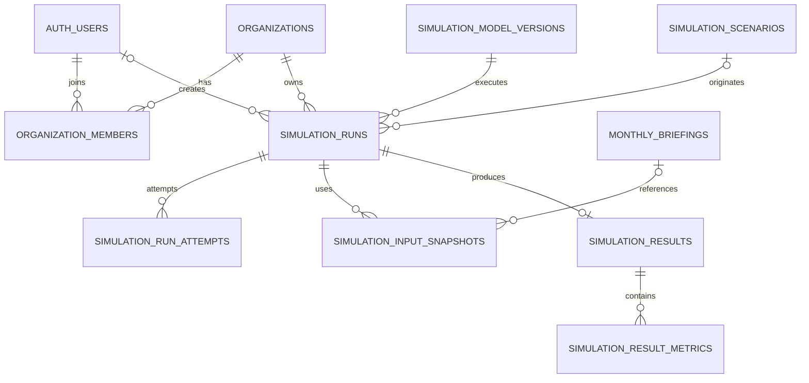

# Supabase 시뮬레이션 저장 설계

> 2026-09-20: 향후 예측 엔진용 참고 설계로 유지한다. 현재 기능에 적용할 기준은 [데이터베이스 재설계](supabase-database-design.md)다. 과거 축제 통계 조회를 위해 이 문서의 워커/실행 테이블을 먼저 만들 필요는 없다.

작성일: 2026-09-19. 상태: **향후 모델 실행 확장 설계**. 현재 서비스 통합의 진입점은 [Supabase 통합 설계·운영](supabase-integrated-design.md)이다. 기관·회원·시나리오 저장은 정식 마이그레이션과 앱/API에 구현했고, 이 문서의 모델 실행·워커·결과 테이블은 제안 단계다. 원격 Supabase DDL은 실행하지 않았다.

사용자 결정: 같은 팀·기관 구성원이 시뮬레이션을 공동 조회한다.

## 1. 핵심 결정

실행 한 번을 `simulation_runs` 한 행으로 보존한다. 실행 조건, 실제 사용한 데이터, 모델 버전, 산출 결과를 연결한다. 조건을 바꾸거나 재분석하면 새 실행을 생성한다. 과거 결과의 조건과 수치를 덮어쓰지 않는다.

소유자는 개인이 아닌 기관이다. 작성자가 탈퇴해도 기관의 실행 기록은 유지한다. 현재 구성원만 조회할 수 있고, 기관에서 제거된 사용자는 기존 JWT가 남아 있어도 구성원 테이블 조회에서 접근이 차단되어야 한다.

Supabase는 영속 저장·인증·권한을 담당하고, FastAPI는 실행 요청 검증·데이터 수집·계산·결과 검증을 담당한다. 기존 월간 LangGraph 브리핑과 정책 시뮬레이션은 별도 기능으로 유지한다.

## 2. 현재 코드와 연결

- `src/stores/useTourismStrategyStore.ts`: 편집 중 입력만 localStorage에 보존한다. 저장된 조건은 URL의 scenario/organization 식별자로 서버에서 다시 조회한다. 향후 실행 결과는 run_id로 조회한다.
- `src/data/policies.ts`: 현재 정책 5개를 유지한다. DB의 policy_code와 API 허용 목록이 함께 갱신되어야 한다.
- `src/data/tourismRegions.ts`: 지역 코드의 원본을 유지한다. 실행 생성 시 FastAPI에서 별칭을 정규 ID로 변환하고 지역명·카탈로그 버전을 저장한다. 초기에는 별도 DB 지역 마스터를 편집하지 않는다.
- `src/types/district.ts`: 방문자는 일별 추정치 합계이고 소비·체류는 지수다. 이를 소비 금액·체류시간·월간 고유 방문객으로 바꾸어 저장하지 않는다.
- `src/pages/dashboard/ReportPage.tsx`: 추후 저장 실행의 `run_id`로 결과를 가져오게 한다. 보고서 표시 시 현재 폼이나 최신 API 데이터와 과거 실행 결과를 섞지 않는다.
- 기존 localStorage의 고정 예시 결과는 실제 분석 이력으로 이관하지 않는다.

현재 월간 브리핑 영속 저장, Supabase 로그인, 기관별 시나리오 저장·조회는 구현되어 있다. 기관/구성원 등록은 운영자가 수행한다. 정책 효과 추정 엔진과 영속 실행 워커는 아직 없다. 시나리오 입력은 simulation_scenarios에 보존하고, 이를 완료된 simulation_runs로 가장하지 않는다.

## 3. ERD



## 4. 테이블과 타입

모델 실행 확장의 DDL·FK·CHECK·인덱스·RLS는 [SQL 설계안](supabase-simulation-schema.proposed.sql)에 있다. 자동 적용되지 않으며, supabase/migrations의 3개 파일을 적용한 뒤에만 검증할 수 있다. 아래 organizations/organization_members는 공통 마이그레이션을 재사용하며 중복 생성하지 않는다.

| 테이블 | 역할 | 주요 필드 |
|---|---|---|
| organizations | 서비스를 사용하는 팀·기관 | id UUID PK, name TEXT, created_at TIMESTAMPTZ |
| organization_members | 사용자와 기관의 다대다 소속·권한 | organization_id/user_id 복합 PK·FK, role TEXT |
| simulation_model_versions | 계산 모델·계수·코드·검증 근거의 버전 | id UUID PK, model_name/version UNIQUE, validation_status, manifest JSONB, manifest_sha256 |
| simulation_runs | 실행 조건과 처리 상태, 기관별 이력 목록 | id UUID PK, organization_id FK, created_by FK, 지역·정책·예산·기간, model_version_id FK, status, idempotency_key |
| simulation_run_attempts | 실행 시도별 워커·종료 상태의 운영 이력 | run_id/attempt_no 복합 PK, worker_id, worker_token UNIQUE, status, started_at/finished_at, error_code |
| simulation_input_snapshots | 계산에 실제 사용한 출처별 입력 | id UUID PK, run_id FK, source_key, 출처별 기준일/기간, payload JSONB, payload_sha256 |
| simulation_results | 실행의 요약·추천·타임라인 | run_id UUID PK/FK, summary, recommendations/timeline/limitations JSONB, narrative_provenance JSONB |
| simulation_result_metrics | 비교·차트에 쓰는 수치 결과 | run_id/metric_key/horizon_month 복합 PK, unit, observed_value, without_policy_value, with_policy_value, delta_value, delta_pct |

별도 users/passwords 테이블은 만들지 않고 Supabase Auth의 `auth.users`를 참조한다. 결과 본문은 JSONB, 검색·권한·정렬·비교에 필요한 필드는 정규 컬럼으로 분리한다. 전체 실행을 하나의 JSON으로 저장하지 않는다.

### 실행 조건

- `title TEXT`: 생성 시 서버가 확정된 지역명·정책명·예산·기간으로 자동 생성한다. 예: `동구 · 야간관광 확대 · 15억 원 · 6개월`. 예산은 원 단위 저장값을 손실 없이 표시하고 제목은 160자 이내로 제한한다. 초기 API는 제목을 입력받지 않으므로 신규 제목 입력 UI는 필요 없다. 생성 후 현재 폼 값으로 다시 만들지 않는다.
- `budget_krw BIGINT`: 원 단위. 화면의 15억은 1,500,000,000원으로 변환한다. 숫자 15만 저장하지 않는다.
- `start_month DATE`: 시행 시작월의 1일. 현재 폼에는 없는 필드이므로 추가해야 한다. 기준 데이터의 월과 정책 시행 월은 다르다.
- `duration_months SMALLINT`: 3·6·12. 현재 '1년' 문자열을 12로 변환한다.
- `district_id TEXT`: 정규 5자리 코드. 행정구역 개편에 대비해 지역명과 catalogue_version도 보존한다.
- `scenario_parameters JSONB`: 정책별 추가 입력의 버전 있는 구조. 모든 객체를 그대로 허용하지 않고 Pydantic 계약으로 검증한다. 예를 들어 행사 횟수·셔틀 운행일 등의 입력은 해당 모델이 실제로 사용할 때만 도입한다.
- `execution_config JSONB`: 실제 사용한 모델 실행 옵션·난수 seed 등. 인증키를 포함하지 않는다.
- `parent_run_id`: 같은 기관의 원래 실행. 조건 변경·사용자 재실행은 이 값으로 관계를 남기되 기존 결과는 보존한다.

### 입력 스냅샷

출처마다 기준월이 달라 하나의 `base_ym`으로 전체를 대표하지 않는다. 예를 들어 방문자 2026-07, 지수 2026-08, 콘텐츠 조회일 2026-09-19를 별도 행으로 저장한다.

월간 브리핑을 실제 입력에 사용하면 스냅샷의 `(region_id, district_id, briefing_month)`로 기존 `monthly_briefings`의 고유 키를 참조한다. 스냅샷 지역은 run의 복합 FK와도 일치해야 한다. 전체 브리핑을 복제하지 않고 계산에 사용한 정제 값·변환 버전만 payload에 기록한다. briefing_month=NULL인 일반 입력도 허용한다. 저장 시나리오에서 실행을 만들 때 source_scenario_id로 같은 기관의 원본 조건을 참조하고, 서버가 지역·조건 복사와 변경 여부를 검사한다.

`source_key`는 `visitors:202607`, `indices:202608`처럼 실행 내에서 고유하다. `payload`에는 모델이 실제로 소비한 정제 값, 단위, 실제 공급자 지역코드, 누락 여부와 사용한 특징값을 보존한다. 원본과 변환이 결과에 영향을 주면 그 원본 부분 및 변환 버전도 보존한다. 수집 실패도 unavailable 스냅샷으로 기록한다.

스냅샷을 모두 확정한 뒤 계산한다. 내부 워커 재시도에서는 같은 스냅샷과 모델을 사용한다. 새 데이터로 다시 계산하려면 새 실행을 생성한다. SHA-256은 서버에서 정규화한 JSON으로 계산하고, 해시만 저장하지 않고 payload도 보관한다.

전체 전국 원문이나 대용량 학습 데이터는 매 실행마다 복사하지 않는다. 필요해질 경우 private Storage의 덮어쓰기 금지 경로·체크섬·버전으로 확장하고, 서명 URL은 DB에 저장하지 않는다. 초기 SQL은 JSONB 입력을 전제로 한다.

### 모델 버전

manifest에는 코드 리비전, 모델 아티팩트 위치·체크섬, 학습/계수 자료 버전, 특징값 정의, 지원 정책·지표·기간, 검증 결과를 넣는다. 새 분석에는 `validated` 버전만 서버가 선택한다. 검증된 모델이 없으면 `MODEL_NOT_READY`로 실행 요청을 거절한다. 목업 수치를 완료 결과로 기록하지 않는다.

`validated`는 아래 검사를 통과하여 **manifest에 명시한 기능 범위로 운영 승인된 버전**을 뜻한다. 단위 테스트 통과만으로 미래 예측이나 인과효과까지 검증됐다는 뜻은 아니다. 검증 기준은 모델 등록 전에 정하고, 결과를 본 뒤 기준을 낮춰 승인하지 않는다.

| 승인 범위 | 필요한 검증 근거 | 허용되는 결과 해석 |
|---|---|---|
| 공통 필수 | 실제 입력 사용, 입력·단위·결측 계약, 계산식/특징 변환의 정확성, 코드·자료 버전 고정, 지원 지역·기간·지표 확인 | 지원 범위 내 계산만 허용 |
| 조건부 시나리오 계산 | 계산식·계수 출처와 가정, 적용 범위, 독립 계산 사례 대조 및 민감도 검사 | 가정하의 `scenario_difference`. 실증적으로 검증된 예측·정책 효과로 표시하지 않음 |
| 미래 예측 | 시간 순서에 맞는 별도 평가 자료, 비교 기준 모델, 사전 정의한 지표·합격 기준과 실제 성능, 지원 기간/지역 및 추정 구간 검사 | 검증 범위 내 예측. 그 차이를 자동으로 인과효과라고 부르지 않음 |
| 인과효과 추정 | 개입·결과 정의, 식별 가정, 비교 집단 또는 식별 전략, 교란/민감도·불확실성 검토와 승인 기록 | 승인된 정책·지표에 한해 `causal_estimate` |

`manifest.validation`에 `approved_capabilities`, `criteria_version`, `checks`(기준·관측 결과·통과 여부·근거 참조), `approved_by`, `approved_at`을 필수로 기록한다. 승인 권한은 모델 운영 담당자에게만 둔다. 기관 admin 역할만으로 모델을 승인할 수 없다. FastAPI가 이 구조와 요청별 승인 범위를 검증하며, SQL의 상태 문자열만 바꿔서는 실행 승인이 성립하지 않는다. 현재 자료만으로 특정 정확도 기준이나 검증 성공을 임의로 선언하지 않는다.

이미 참조된 manifest·버전은 수정하지 않는다. 수정은 새 버전으로 만들고 이전 버전은 retired 처리한다. retired 모델로 만든 과거 결과는 계속 조회할 수 있다. 모델·입력·출력 보존은 결과를 감사할 근거이며, 외부 LLM 같은 비결정적 서비스의 비트 단위 재현을 보장하지는 않는다.

### 수치 결과와 효과의 의미

| 필드 | 의미 |
|---|---|
| observed_value | 실제 관측 기준값. 미래 예측값과 별개이며 입력의 기준 기간을 참조 |
| without_policy_value | 같은 미래 기간에 해당 정책을 시행하지 않는 경우의 예측 |
| with_policy_value | 같은 미래 기간에 해당 정책을 시행하는 경우의 예측 |
| delta_value | with_policy_value − without_policy_value, DB 생성 컬럼 |
| delta_pct | 위 차이 / abs(without_policy_value) × 100, 분모 0이면 NULL |
| effect_type | 실제 산출한 효과의 종류. 수치가 있으면 scenario_difference 또는 causal_estimate 필수, 산출 불가이면 NULL. 승인된 인과 추정 근거가 있을 때만 후자 사용 |
| effect_lower / effect_upper / interval_level | 같은 단위의 효과 추정 구간과 수준. 모델이 산출할 때만 저장 |
| unavailable_reason | 산출 불가 이유. 추정값 두 개를 모두 NULL로 저장하고 0으로 채우지 않음 |

과거 대비 증가율과 정책으로 인한 효과를 혼동하지 않도록 두 미래 예측을 나눈다. 입력 소비지수가 있다고 금액 효과를 추정할 수 있는 것은 아니다. `metric_key`·단위·집계 방식·출처의 조합을 모델 계약으로 제한한다. 혼잡·체류시간처럼 필요한 자료가 없으면 해당 지표는 산출 불가로 저장한다.

`horizon_month=0`은 전체 시행 기간의 집계, 1~duration_months는 월별 예측이다. `aggregation`은 sum/mean/end_of_period를 구별한다. 차트·전략 비교는 같은 지표 정의·단위·예측 기간·집계 방식을 가진 결과만 수치로 비교한다. 지역·모델·자료 버전이 다르면 그 차이를 표시한다.

추천 문장과 타임라인은 이 저장 결과를 참조한다. LLM이 설명을 생성한다면 provider/model/prompt_version을 narrative_provenance에 남기고, 검증된 수치를 바꾸거나 근거 없는 수치를 추가하지 못하게 한다. 상세 내부 메타데이터를 사용자 화면에 안내 패널로 노출할 필요는 없다.

## 5. 저장·실행 흐름

1. React가 조건과 Idempotency-Key를 FastAPI로 전송한다. JWT는 서버에서 검증하고 created_by는 검증된 사용자 ID로 설정한다.
2. FastAPI가 현재 기관 소속과 editor/admin 권한, 지역·정책·예산·기간 및 모델 지원 여부를 검증한다.
3. 짧은 DB 트랜잭션에서 queued 실행을 생성하고 202와 run_id를 반환한다. `(organization_id, idempotency_key)`가 같고 요청 해시가 같으면 기존 run_id를 반환한다. 같은 키에 다른 본문이면 409로 거절한다.
4. 별도 지속 실행 워커가 queued 행을 원자적으로 점유한다. 입력 수집·계산 중 DB 트랜잭션을 오래 잡지 않는다. FastAPI의 프로세스 내 BackgroundTasks만으로 내구성 있는 작업 처리를 대신하지 않는다.
5. 입력 스냅샷을 확정하고 모델을 실행한다. 결과 스키마, 단위, 출처 참조, 타임라인 범위와 수치를 검증한다.
6. 하나의 DB 트랜잭션에서 results와 metrics를 삽입하고 상태를 succeeded 또는 insufficient_data로 변경한다. 결과만 저장되거나 성공 상태만 저장되는 부분 완료를 허용하지 않는다.
7. React는 run_id 상태를 조회한다. 화면을 닫아도 실행·결과는 유지한다. 초기에는 폴링을 사용하고 필요하면 Realtime을 별도로 추가한다.

성공·자료부족·실패·취소도 실행 이력에 남긴다. 고정 3초 대기는 제거한다. UI에서 조건을 바꾸면 현재 결과 연결을 해제하지만 이미 저장된 이전 실행은 삭제하지 않는다.

### 상태 전이와 동시 실행

```text
queued → running → succeeded
                 → insufficient_data
                 → failed
queued / running → cancelled
running --워커 임대 만료·재시도 한도 이내--> queued
```

워커는 `FOR UPDATE SKIP LOCKED`로 행을 점유하고 attempt_no를 증가시키며 새 worker_token·lease_expires_at을 기록한다. 실행 중 임대를 갱신한다. 회수 워커가 만료된 실행만 재대기 처리하고 횟수 한도를 넘기면 failed로 종료한다.

점유 트랜잭션에서 같은 번호의 `simulation_run_attempts` 행도 생성한다. `worker_id`는 워커 프로세스 인스턴스 식별자이고 `worker_token`은 그 시도의 점유 토큰이다. 같은 실행에 running 시도는 하나만 허용한다. 완료·실패·임대 만료·취소 시 해당 시도의 상태와 종료 시각을 기록하며 실패/임대 만료는 안전한 내부 error_code를 남긴다. 스택·인증키는 저장하지 않는다. run의 현재 임대 필드를 비워도 시도 이력은 보존한다.

완료 트랜잭션은 run 행을 잠그고 status=running, worker_token 일치, 임대 유효를 다시 확인한다. 오래된 워커·취소된 실행의 쓰기는 거절한다. 결과 삽입과 상태 변경은 같은 트랜잭션으로 실행한다. 중복 전달·재실행이 생길 수 있으므로 '정확히 한 번 계산'을 가정하지 않는다.

이 트랜잭션은 시도 행의 종료도 함께 기록한다. 임대 회수는 기존 시도를 lease_expired로 종료한 뒤 run을 queued 또는 failed로 바꾸는 하나의 트랜잭션이다. 종료된 시도 행은 수정하지 않으며 새 점유는 새 번호를 쓴다. 대기 중 취소처럼 아직 워커가 시작하지 않은 실행에는 시도 행을 만들지 않는다.

취소 요청은 run 행을 잠근 뒤 현재 상태·요청자 권한을 검사한다. `cancelled_by`는 검증된 사용자 ID, `cancelled_at`은 서버 처리 시각, `cancel_reason`은 1~500자의 사유를 저장한다. 사유 입력이 없으면 서버가 `사용자 요청으로 취소`를 기록한다. 같은 트랜잭션에서 finished_at=cancelled_at, status=cancelled로 변경하고 실행 중 시도가 있으면 cancelled로 종료한다. 비취소 상태에서는 취소 필드를 모두 NULL로 유지한다. 사용자 계정 삭제로 cancelled_by가 NULL이 되어도 사유·시각·기관 기록은 보존한다. 취소를 failed의 error_code로 표현하지 않는다.

사용자가 재실행하면 새 idempotency_key와 새 run을 만들고 parent_run_id를 기록한다. 네트워크 재전송에는 같은 키를 재사용한다. 동일 조건이라는 이유만으로 사용자 실행 이력을 합치지 않는다.

### DB가 보장하는 것과 서버가 구현해야 하는 것

SQL은 타입·FK·기관 일치 parent FK·중복 생성 방지·상태별 NULL 조합·숫자 결측/무한값 제한·조회 권한을 정의한다.

다음 항목은 SQL 파일만 적용해도 자동 완성되는 기능이 아니다. FastAPI/워커의 제한된 쓰기 경로와 트랜잭션으로 구현하고 테스트해야 한다.

- 실행 입력·스냅샷·결과의 불변성, 모델 manifest의 불변성.
- 허용된 상태 전이 및 워커 임대 검증.
- run의 attempt_no/worker_token과 현재 시도 행의 일치, 점유·종료·회수·취소의 원자적 기록, 종료 시도 이력의 불변성.
- 모델 manifest.validation의 승인 기준·근거·권한 검사와 요청된 지표/효과 종류의 승인 범위 확인.
- 성공 상태와 결과의 동시 확정, 결과 수치와 모델 계약의 일치.
- `source_keys`가 같은 run의 입력을 가리키는지 검사.
- horizon_month가 duration_months 이내인지, timeline 날짜가 시행 기간 이내인지 검사.
- insufficient_data는 추정 수치 없는 결과, succeeded는 모델의 최소 필수 지표를 충족한 결과라는 의미 검증.
- 기관·회원 관리 권한과 마지막 admin 제거 방지.

Supabase REST API에 여러 번 insert/update하는 것으로 트랜잭션을 대체하지 않는다. 실제 구현에서는 PostgreSQL 연결의 트랜잭션을 사용하거나 서버 전용 RPC 하나로 묶는다. RPC를 만들면 SECURITY INVOKER를 기본으로 하고 PUBLIC/anon/authenticated의 EXECUTE를 회수한다. 현재 시나리오 저장은 서버 전용 scenario_save RPC로 구현되어 있다. 이 확장 설계에는 모델 실행 RPC나 워커 구현이 포함되지 않는다.

## 6. 권한

| 작업 | viewer | editor | admin |
|---|---|---|---|
| 같은 기관 실행 목록·결과 조회/비교 | 가능 | 가능 | 가능 |
| 새 분석 실행·조건 변경 후 재실행 | 불가 | 가능 | 가능 |
| 실행 취소 | 불가 | 본인 실행 | 기관 실행 |
| 구성원 추가·제거·역할 변경 | 불가 | 불가 | 가능 |
| 완료 수치·실행 조건 덮어쓰기 | 불가 | 불가 | 불가 |

기관은 Supabase 프로젝트의 운영 조직과 별개인 이 서비스의 업무 기관이다. 초기에 모든 사용자에게 기관 생성 권한을 줄 필요는 없다. 초기 기관과 최초 admin은 승인된 서버 관리 흐름으로 등록한다. 이메일 도메인이나 사용자가 수정할 수 있는 user_metadata로 기관 소속을 인정하지 않는다.

노출 스키마의 모든 테이블에 RLS를 켠다. SQL은 로그인 사용자의 본인 membership 행을 통해 기관·실행·결과를 조회하도록 한다. membership 정책이 자기 테이블을 재귀 조회하지 않는다. 전체 입력·모델 manifest·실행 시도 이력은 서버만 읽고, 필요한 출처 요약만 FastAPI가 검증 후 제공한다. 운영 API도 worker_token을 브라우저에 반환하지 않는다.

브라우저에는 결과 INSERT/UPDATE/DELETE 권한을 주지 않는다. 결과 작성과 기관 회원 관리 모두 FastAPI를 거친다. 서버용 secret/service_role 권한은 RLS를 우회할 수 있으므로 **서버도 요청마다 JWT와 현재 기관 소속·역할을 검사하고 쿼리를 organization_id로 제한**한다. 단순히 RLS를 켰다는 이유로 서버의 권한 검사를 생략하지 않는다. publishable key와 사용자 JWT의 조회 경로에는 RLS가 적용된다.

사용자 탈퇴 시 created_by는 NULL이 되어도 기관 실행은 보존한다. 기관 삭제는 FK RESTRICT로 막고 일반 API에서 제공하지 않는다. 보존 기간·기관 삭제 절차는 실제 운영 정책 확정 후 별도 설계한다. 초기에는 완료 실행 삭제 기능을 제공하지 않는다.

## 7. API와 화면

| API | 역할 |
|---|---|
| POST /api/organizations/{org_id}/simulations | 조건 검증, 실행 생성, 202 + run_id |
| GET /api/organizations/{org_id}/simulations | 지역·정책·상태 필터, 최신순 커서 페이지 |
| GET /api/organizations/{org_id}/simulations/{run_id} | 저장된 조건·상태·결과 조회 |
| POST /api/organizations/{org_id}/simulations/{run_id}/cancel | 권한·상태 확인 후 취소, 선택 입력 reason과 서버가 정한 취소자·시각 기록 |
| POST /api/organizations/{org_id}/simulations/compare | 같은 기관의 run_id 목록 검증 후 비교 |

재실행은 첫 POST에 parent_run_id를 넣는다. 별도 임의 결과 저장 API는 두지 않는다. 생성 요청에서 title/created_by/status/result 필드는 받지 않는다. title은 서버가 확정 조건으로 자동 생성한다. 취소 요청에서도 cancelled_by/cancelled_at은 받지 않는다.

FastAPI에는 기존 origin 프록시 인증과 별개로 사용자 인증이 필요하다. `FASTAPI_PROXY_TOKEN`은 기관 사용자 신원을 증명하지 않는다. 현재 Vercel 어댑터는 월간 브리핑 GET/POST와 시나리오 GET/POST, 사용자 Authorization·Idempotency-Key·JSON 본문을 경로별로 전달한다. 향후 실행 API를 추가할 때도 명시적으로 허용하고 같은 인증 검사를 연결해야 한다. 기존 관광 GET 프록시의 메서드 허용 범위를 무작정 넓히지 않는다.

## 8. 인덱스와 확장

- `(organization_id, created_at DESC, id DESC)`: 기관별 최신 실행 목록과 커서 페이지.
- `(organization_id, district_id, created_at DESC, id DESC)`: 지역별 이력.
- `(user_id, organization_id)`: 소속 조회와 RLS.
- queued/running 전용 부분 인덱스: 워커 작업 선택·임대 만료 확인.
- 시도 이력의 `(run_id, attempt_no)` PK와 running 행의 run_id UNIQUE 부분 인덱스: 시도별 조회 및 중복 점유 이력 방지.
- `(run_id, source_key)`, `(run_id, metric_key, horizon_month)`: 입력 및 수치 중복 방지, 특정 결과 조회.
- parent/model/creator FK의 보조 인덱스: 참조 조회와 삭제 검사.

기관 범위를 먼저 제한하고 최신 실행을 페이지 단위로 읽는다. 초기에는 모든 JSONB에 GIN 인덱스, 파티셔닝, 별도 데이터 웨어하우스를 도입하지 않는다. 실제 조회 패턴과 EXPLAIN 결과에 따라 추가한다. 실행당 입력 크기·보존량을 측정하고 제한한다.

정책 조합 비교나 보고서 묶음 저장이 필요해지면 comparison_sets/comparison_items 또는 reports/report_runs를 추가한다. 지금은 선택한 run_id 목록으로 비교할 수 있어 별도 테이블이 필수는 아니다.

## 9. 구현 검증과 적용 순서

1. 개발용 Supabase 환경에서 DDL, RLS, FK와 제약을 검증한다. 현재 설계 SQL은 실DB 미실행이다.
2. 인증과 기관 관리, 실행 목록·조회 API를 구현한다.
3. 저장 가능한 실제 모델 계약·검증 자료를 등록한다. 현재 목업 값을 모델로 등록하지 않는다.
4. 실행 생성·영속 워커·입력 스냅샷·원자적 결과 저장을 연결한다.
5. React 시뮬레이션·전략·보고서를 같은 run_id로 연결한다.

필수 검증:

- 기관 A 회원이 B의 run_id를 알아도 조회·취소·재실행·비교 접근이 거절되는지.
- viewer 쓰기, 브라우저 직접 결과 위조, user_id/org_id 변조가 차단되는지.
- 회원 제거 즉시 기존 토큰으로 해당 기관 결과 조회가 차단되는지.
- 동일 키/동일 본문은 한 실행, 동일 키/다른 본문은 409인지.
- 서로 다른 기관의 parent_run_id 연결이 FK에서 거절되는지.
- 워커 중단·재시도·취소와 완료 경합에서 중복/부분 결과가 남지 않는지.
- 완료 후 현재 임대가 비워져도 워커 식별자·시도별 종료 시각·실패 이유가 보존되는지.
- 대기 중/실행 중 취소 사유·시각·요청자가 기록되고, 계정 삭제 후 취소 이력이 보존되는지.
- 제목 미입력으로 생성해도 서버 제목이 저장되며 재조회 시 같은 실행 조건을 나타내는지.
- 산출 불가 행은 effect_type=NULL, 유효한 수치 행은 effect_type 필수 조건을 DB에서 검사하는지.
- validated 문자열만 설정하거나 승인 범위를 벗어난 지표·인과효과를 요청했을 때 실행이 거절되는지.
- 조건 변경·지역 변경·새로고침 후에도 기존 실행의 조건과 결과가 바뀌지 않는지.
- 15억 원과 1년이 각각 1,500,000,000원·12개월로 저장되는지.
- 결측값·0 기준값·단위 차이·서로 다른 기준월을 올바르게 처리하는지.

실제 마이그레이션은 검증 후 Supabase CLI로 정식 생성한다. 운영 자료가 생긴 뒤 롤백은 테이블 삭제 대신 백업과 전진 마이그레이션을 우선한다. 초기 빈 스키마의 제거는 이 확장의 6개 신규 테이블만 역의존 순서로 대상으로 삼고 auth.users나 기존 서비스 테이블을 건드리지 않는다.

## 10. 공식 자료 확인

- [Row Level Security](https://supabase.com/docs/guides/database/postgres/row-level-security): RLS, SELECT 권한, 서비스 권한 우회, auth.uid()와 인덱스.
- [JWT Signing Keys](https://supabase.com/docs/guides/auth/signing-keys): 서버의 사용자 JWT 검증과 키 교체.
- [Supabase changelog](https://supabase.com/changelog): 확인일 2026-09-19. Markdown 엔드포인트를 읽지 못해 HTML 변경 이력을 확인했다. 이번 제안은 관리 API logs, Realtime 내부 스키마 수정, 확장 버전 고정 등 최근 변경 기능에 의존하지 않는다.
