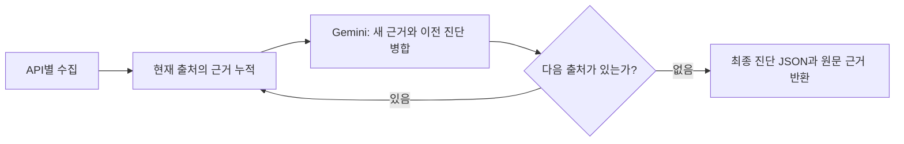

# 월간 브리핑 사용 및 코드 설명

> 2026-09-18 FastAPI 통합 추가: 아래 내용은 팀원 구현 원문이다. 현재 실행은 FastAPI가 같은 LangGraph 서비스를 Node 워커로 호출하며, Vercel도 FastAPI로 전달한다. TOUR/GEMINI 키는 FastAPI에 설정한다. 현재 KPI·별도 진단·보고서는 FastAPI 실데이터와 연결되어 있다. 설치·배포 변경은 [통합 기록](팀원_PR7_FastAPI_통합_기록.md)을 우선 참고한다.

## 시작하기

1. 프로젝트 최상위 `.env.local`을 연다. 이 파일은 Git에서 제외된다.
2. `TOUR_API_SERVICE_KEY`에는 공공데이터포털 인증키를 입력한다. 이번 작업에서는 예시 파일에 있던 기존 키를 이 파일로 옮겼다.
3. `GEMINI_API_KEY=`의 등호 뒤에 Google AI Studio에서 발급받은 키를 입력한다. 키를 채팅이나 Git에 붙여 넣지 않는다.
4. `GEMINI_MODEL`의 기본값은 `gemini-3.8-flash`다. 계정에서 사용할 수 있는 모델로 변경할 수 있다.
5. `npm run dev`로 개발 서버를 시작한다. 환경변수를 변경하면 개발 서버를 다시 시작한다.
6. 자치구의 지역 현황 화면에서 **월간 브리핑 → 진단 월**을 선택한다. 기본값은 한국 날짜 기준 직전 달이다.

Gemini 키가 없어도 관광 자료와 축제는 수집한다. 이 경우 화면에는 **수집 근거만 표시**라고 나오며 AI 진단을 만들었다고 표시하지 않는다. 키가 설정된 서버에서 처음 조회하는 지역·월은 순차 모델 호출 때문에 몇 분이 걸릴 수 있다.

배포할 때는 Vercel의 서버 환경변수에도 `TOUR_API_SERVICE_KEY`, `GEMINI_API_KEY`, `GEMINI_MODEL`을 설정해야 한다. 로컬 `.env.local`은 배포되지 않는다. 키 이름에 `VITE_`를 붙이면 브라우저에 공개되므로 붙이지 않는다. 서버 함수는 최대 300초, 내부 작업은 최대 240초로 구성했다. 사용하는 배포 환경이 해당 실행 시간을 지원해야 한다.

## 어떤 정보를 가져오는가

| 출처 | 사용 정보 | 해석 시 주의점 |
| --- | --- | --- |
| DataLabService | 관광객 구분별 일별 방문 수 | 날짜별 합계는 월간 순방문자가 아니다. 누락 날짜가 있으면 부분 수집이다. |
| AreaTarResDemService | 관광 서비스 수요·문화 자원 수요 | 종합 지표값이며 인원이나 원 단위 소비액이 아니다. |
| AreaTarDemDsService | 관광 체류 강도·소비 강도 | 평균 체류시간이나 실제 소비액으로 바꾸지 않는다. |
| AreaTarDivService | 관광객·소비·국제 다양성 | 연령별 실제 인원을 생성하지 않는다. |
| LocgoHubTarService1 | 중심 관광지 상위 5개 | 중심 순위는 방문자 수가 아니다. |
| KorService2 | 최근 종료·예정 축제 | API에 존재하는 행사명과 일정만 표시한다. |

전체 6개 서비스의 10개 상세기능을 조회한다. 사진·오디오·채용 등 월간 진단과 직접 관련이 적은 서비스는 이번 기능에서 사용하지 않는다. 기존의 다른 진단 페이지와 KPI 예시 데이터는 이 API에 연결하지 않았다.

## 지역 코드가 두 종류인 이유

2026-07-01 행정구역 개편으로 코드가 변경됐다. 통계는 **선택 월**에 해당하는 코드를 사용하고, 축제는 **현재 조회일**의 코드를 사용한다. 이름이 같은 다른 지역의 동구·서구가 섞이지 않도록 응답의 코드도 확인한다.

| 자치구 | 2026년 6월까지 통계 | 2026년 7월부터 통계 및 현재 축제 |
| --- | --- | --- |
| 동구 | 29110 | 12210 |
| 서구 | 29140 | 12240 |
| 남구 | 29155 | 12270 |
| 북구 | 29170 | 12300 |
| 광산구 | 29200 | 12330 |

근거: [행정안전부 변경 공지](https://www.mois.go.kr/frt/bbs/type001/commonSelectBoardArticle.do?bbsId=BBSMSTR_000000000052&nttId=127039), 한국관광공사 `KorService2/ldongCode2` 실제 응답. 현재 UI의 전체 지역명이나 지도 코드까지 바꾸는 작업은 포함하지 않았다.

## LangGraph가 진단을 만드는 과정

1. **수집:** 독립적인 API 세 개씩 요청한다. 전국 자료만 제공하는 방문자 API는 페이지를 읽은 후 지역을 필터링한다. 방문자 자료는 최대 30페이지, 다른 자료는 최대 5페이지이며 페이지당 1,000건을 요청한다. 응답의 전체 건수까지 읽지 못하면 부분 수집으로 표시한다.
2. **정규화:** 문자열 수치를 검증하고 방문 수를 관광객 유형별로 합산한다. 지표값, 날짜, 지역은 서버 코드가 확인한다. 빈 문자열을 0으로 바꾸지 않는다.
3. **점진 병합:** 각 출처의 새 근거와 이전 단계의 진단을 Gemini에 전달한다. 원문 근거 목록도 계속 보존하므로 앞 단계의 요약만 전달해서 숫자가 사라지는 것을 피한다.
4. **검증:** Gemini 응답을 Zod로 검사한다. 요약·진단·제안은 실제 근거 식별자를 인용해야 한다. 없는 식별자를 사용한 응답은 거부한다.
5. **장애 처리:** 특정 API가 없거나 모델 호출이 실패해도 확보한 근거는 유지한다. 일부 모델 병합이 실패하거나 자료가 누락되면 화면에 일부 분석이라고 표시한다.

숫자를 임의로 만들거나 근거 없이 높음·낮음·증감을 판단하지 않도록 프롬프트에서 제한한다. 다만 출처 식별자 검증은 AI 문장 전체의 의미적 정확성을 증명하는 장치는 아니므로 정책 결정 전에는 수집 근거도 확인해야 한다.

## 각 파일의 역할

| 파일 | 역할 |
| --- | --- |
| `server/briefing/data.ts` | 날짜·지역 코드, 고정된 API 목록, 페이지 수집, 유형별 수치 정리, 축제 분류 |
| `server/briefing/graph.ts` | 실제 LangGraph 노드와 반복 경로, Gemini REST 요청, 진단 스키마와 인용 검증 |
| `server/briefing/service.ts` | 지역·월 입력 검증, 같은 요청의 중복 실행 방지, 메모리 캐시, 오류 응답 |
| `api/monthly-briefing.ts` | 배포 환경에서 사용할 서버 API 진입점 |
| `vite.config.ts` | 개발 서버에서도 같은 API 서비스를 호출하는 연결부 |
| `src/types/briefing.ts` | 서버와 화면이 공유하는 응답 자료형 |
| `src/components/dashboard/MonthlyBriefing.tsx` | 월 선택, 대기·오류·결과 화면, 진단·근거·축제 표시 |
| `src/pages/dashboard/OverviewPage.tsx` | 지역 현황에서 새 월간 브리핑을 불러오는 연결부 |
| `server/briefing/briefing.test.ts` | 날짜·지역·수집·모델 검증·그래프·캐시 자동 검사 |
| `scripts/check_monthly_briefing.ts` | 실제 API 연결 점검. 키와 요청 URL은 출력하지 않음 |

기존 `DailyBriefing.tsx`와 `OngoingFestivals.tsx`는 삭제하지 않았다. 지역 현황 화면은 새 컴포넌트를 사용한다.

## 축제 표시 규칙

- 최근 종료: 오늘 이전에 끝났으며 최근 1년 이내인 행사, 종료일 최신 순 최대 3개.
- 앞으로 열릴 축제: 오늘 이후 90일 안에 시작하는 행사, 시작일 빠른 순 최대 3개.
- 오늘 시작하거나 아직 끝나지 않은 행사는 두 목록에서 제외한다.
- 시작일과 종료일이 유효하지 않으면 제외한다. 동일 행사 ID와 시작일이 같은 항목은 중복 제거한다.
- 시작일 검색으로 최근 2년 자료를 수집한다. 그보다 오래전에 시작한 장기 행사는 빠질 수 있다.
- 축제 목록은 월간 통계의 성과를 뜻하지 않는다. 화면에 통계 월과 별도의 축제 조회일을 표시한다.

## 테스트와 실제 확인

- `npm run test:briefing`: 외부 키나 네트워크 없이 자동 검사한다.
- `npm run build`: TypeScript와 실제 프런트엔드 빌드를 검사한다.
- `npm run check:briefing -- donggu 2026-08`: 관광 API만 호출한다.
- `npm run check:briefing -- donggu 2026-08 --with-gemini`: 키 설정 후 실제 Gemini까지 호출한다. 모델 이용 요금이 발생할 수 있다.
- `npm run check:briefing -- donggu 2026-08 --inspect`: 키·URL을 제외하고 수집 API의 지역·기간 코드와 건수를 확인한다. 이 옵션에서는 Gemini를 호출하지 않는다.

2026-09-17 확인 시 동구의 2025년 9월은 통계·중심 관광지 9개 기능에서 자료가 수집됐다. 2026년 8월은 새 코드로 수요·체류·소비·다양성 지표를 수집했고 방문 수는 일부 날짜만 제공돼 부분 수집으로 표시됐다. 해당 월의 중심 관광지 자료는 비어 있었다. 예정 축제에는 광주 추억의 충장축제와 광주버스킹월드컵이 확인됐다. Gemini 키가 없어 실제 모델 응답은 검증하지 못했고, 모의 응답을 사용한 그래프 및 REST 요청 구조 검증을 수행했다.

캐시는 한 서버 프로세스에서만 공유한다. 서버리스 인스턴스가 여러 개면 중복 생성이 가능하며, 본격 운영 시 공유 캐시와 인증·호출량 제한을 추가하는 것이 다음 과제다. 이번 구현의 동시 실행 제한은 인스턴스당 두 건이다.

공식 기술 문서: [LangGraph 그래프 API](https://docs.langchain.com/oss/javascript/langgraph/graph-api), [Gemini 구조화 출력](https://ai.google.dev/gemini-api/docs/generate-content/structured-output), [Gemini 모델 정보](https://ai.google.dev/gemini-api/docs/models/gemini-3.8-flash).
